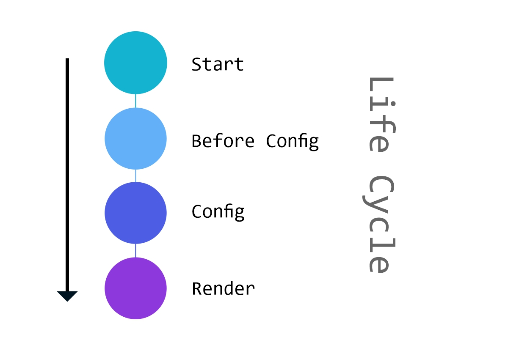

 
# Revue Framework 

![Build Status](https://img.shields.io/static/v1?label=version&color=blueviolet&message=0.0.2-alpha&logo=data:image/svg+xml;base64,//48AHMAdgBnACAAeABtAGwAbgBzAD0AIgBoAHQAdABwADoALwAvAHcAdwB3AC4AdwAzAC4AbwByAGcALwAyADAAMAAwAC8AcwB2AGcAIgAgAHgAbQBsADoAcwBwAGEAYwBlAD0AIgBwAHIAZQBzAGUAcgB2AGUAIgAgAHYAZQByAHMAaQBvAG4APQAiADEALgAxACIAIABzAHQAeQBsAGUAPQAiAHMAaABhAHAAZQAtAHIAZQBuAGQAZQByAGkAbgBnADoAZwBlAG8AbQBlAHQAcgBpAGMAUAByAGUAYwBpAHMAaQBvAG4AOwAgAHQAZQB4AHQALQByAGUAbgBkAGUAcgBpAG4AZwA6AGcAZQBvAG0AZQB0AHIAaQBjAFAAcgBlAGMAaQBzAGkAbwBuADsAIABpAG0AYQBnAGUALQByAGUAbgBkAGUAcgBpAG4AZwA6AG8AcAB0AGkAbQBpAHoAZQBRAHUAYQBsAGkAdAB5ADsAIABmAGkAbABsAC0AcgB1AGwAZQA6AGUAdgBlAG4AbwBkAGQAOwAgAGMAbABpAHAALQByAHUAbABlADoAZQB2AGUAbgBvAGQAZAAiAA0ACgB2AGkAZQB3AEIAbwB4AD0AIgAwACAAMAAgADIAMgAwACAAMgAyADAAIgANAAoAIAB4AG0AbABuAHMAOgB4AGwAaQBuAGsAPQAiAGgAdAB0AHAAOgAvAC8AdwB3AHcALgB3ADMALgBvAHIAZwAvADEAOQA5ADkALwB4AGwAaQBuAGsAIgA+AA0ACgAgADwAZABlAGYAcwA+AA0ACgAgACAAPABzAHQAeQBsAGUAIAB0AHkAcABlAD0AIgB0AGUAeAB0AC8AYwBzAHMAIgA+AA0ACgAgACAAIAA8ACEAWwBDAEQAQQBUAEEAWwANAAoAIAAgACAAIAAuAGYAaQBsADAAIAB7AGYAaQBsAGwAOgAjADQARQA1AEUARQA0AH0ADQAKACAAIAAgACAALgBmAGkAbAAzACAAewBmAGkAbABsADoAIwA0AEUANQBFAEUANAB9AA0ACgAgACAAIAAgAC4AZgBpAGwAMQAgAHsAZgBpAGwAbAA6ACMANgAzAEIAMABGADkAfQANAAoAIAAgACAAIAAuAGYAaQBsADQAIAB7AGYAaQBsAGwAOgAjADYAMwBCADAARgA5AH0ADQAKACAAIAAgACAALgBmAGkAbAAyACAAewBmAGkAbABsADoAIwA2ADMARAAyAEYAOQB9AA0ACgAgACAAIAAgAC4AZgBpAGwANQAgAHsAZgBpAGwAbAA6ACMANgAzAEQAMgBGADkAfQANAAoAIAAgACAAXQBdAD4ADQAKACAAIAA8AC8AcwB0AHkAbABlAD4ADQAKACAAPAAvAGQAZQBmAHMAPgANAAoAIAA8AGcAIABpAGQAPQAiAEMAYQBtAGEAZABhAF8AeAAwADAAMgAwAF8AMQAiAD4ADQAKACAAIAA8AGcAIABpAGQAPQAiAF8AMgA1ADUAMgAzADAANwAzADkAOQAwADAAOAAiAD4ADQAKACAAIAAgADwAcABvAGwAeQBnAG8AbgAgAGMAbABhAHMAcwA9ACIAZgBpAGwAMAAiACAAcABvAGkAbgB0AHMAPQAiADIAMgAuADIALAA1ADkALgA1ACAANAA2AC4ANgA5ACwANwAzAC4ANgAgADQANgAuADYAOQAsADEANAA2AC4ANQAyACAAMQAxADAALgAxADkALAAxADgAMgAuADkAOAAgADEAMQAwAC4AMgA3ACwAMgAxADEALgAxADEAIAAyADIALgAwADcALAAxADYAMAAuADUAIAAiAC8APgANAAoAIAAgACAAPABwAG8AbAB5AGcAbwBuACAAYwBsAGEAcwBzAD0AIgBmAGkAbAAxACIAIABwAG8AaQBuAHQAcwA9ACIAMgAyAC4AMgAsADUAOQAuADUAIAAxADEAMAAuADIANwAsADgALgA2ADYAIAAxADkANwAuADgALAA1ADkALgA1ACAAMQA3ADMALgAzADMALAA3ADMALgA2ACAAMQAxADAALgAwADEALAAzADYALgA4ADUAIAA0ADYALgA2ADkALAA3ADMALgA2ACAAIgAvAD4ADQAKACAAIAAgADwAcABvAGwAeQBnAG8AbgAgAGMAbABhAHMAcwA9ACIAZgBpAGwAMgAiACAAcABvAGkAbgB0AHMAPQAiADEAMQAwAC4AMQA5ACwAMQA4ADIALgA5ADgAIAAxADEAMAAuADEAMwAsADIAMQAxAC4AMwA0ACAAMQA5ADcALgA4ACwAMQA2ADAALgAyADcAIAAxADkANwAuADkAMwAsADUAOQAuADIANwAgADEANwAzAC4AMwAzACwANwAzAC4ANgAgADEANwAzAC4ANgA4ACwAMQA0ADYALgA1ADIAIAAiAC8APgANAAoAIAAgACAAPABwAG8AbAB5AGcAbwBuACAAYwBsAGEAcwBzAD0AIgBmAGkAbAAzACIAIABwAG8AaQBuAHQAcwA9ACIANgAyAC4ANQAzACwAOAAyAC4ANQA5ACAAOAA5AC4AMgA3ACwAOQA4AC4AMAAyACAAOAA4AC4ANwA1ACwAMQA1ADIALgAyADIAIAA2ADIALgA1ADgALAAxADMANgAuADkAOAAgACIALwA+AA0ACgAgACAAIAA8AHAAbwBsAHkAZwBvAG4AIABjAGwAYQBzAHMAPQAiAGYAaQBsADQAIgAgAHAAbwBpAG4AdABzAD0AIgA4ADkALgAyADcALAA5ADgALgAwADIAIAAxADAAOQAuADgAOAAsADgANgAuADEAMgAgADEANQA3AC4AMAA4ACwAMQAxADMALgAzADcAIAAxADUANwAuADAAOAAsADgAMgAuADYAOQAgADEAMAA5AC4ANwAyACwANQA1AC4AMwA0ACAANgAyAC4ANQA4ACwAOAAyAC4ANgA5ACAAIgAvAD4ADQAKACAAIAAgADwAcABvAGwAeQBnAG8AbgAgAGMAbABhAHMAcwA9ACIAZgBpAGwAMwAiACAAcABvAGkAbgB0AHMAPQAiADEAMQAwAC4AMQAxACwAMQAxADAALgAwADUAIAAxADUANwAuADEANAAsADEAMwA3AC4AMAA4ACAAMQAzADMALgA3ADYALAAxADUAMAAuADUANwAgADEAMAA5AC4AOAA1ACwAMQAzADYALgA3ADcAIAAiAC8APgANAAoAIAAgACAAPABwAG8AbAB5AGcAbwBuACAAYwBsAGEAcwBzAD0AIgBmAGkAbAA1ACIAIABwAG8AaQBuAHQAcwA9ACIAMQAxADAALgAxADEALAAxADEAMAAuADAANQAgADEAMwAwAC4AMwA5ACwAOQA3AC4AOQAzACAAMQA1ADcALgAwADgALAAxADEAMwAuADMANwAgADEAMwA2AC4AMgAsADEAMgA1AC4AMAAzACAAIgAvAD4ADQAKACAAIAA8AC8AZwA+AA0ACgAgADwALwBnAD4ADQAKADwALwBzAHYAZwA+AA0ACgA=&style=platic&logoColor=white)    


With the renderings currently made on the frontend, I decided to create a micro framework to act on the backend of the application helping to assist in requests made by them.

This framework helps in the creation of applications whose objective is to "appear on google" since each page is rendered on the server side.

Revue is very simple to use. Enjoy!

-----------------------

# Index
  -  [Usage](#usage)
  -  [About Modules](#about-modules)
  -  [About Route](#about-route)
  -  [About Middlewares](#about-middlewares)
  -  [Module App](#module-app)
      - [Components](#components)
      - [Route](#about-route)
      - [Controllers](#Components---Controller)
      - [Middlewares](#about-middlewares)
  -  [Module API](#module-api)
      - [Route](#route)
      - [Controllers](#controllers)
      - [Middlewares](#middlewares)
  -  [Service](#service)
  -  [Model](#model)
  -  [Public](#public)

-----------------------

# Usage

First of all you will need to configure the `conf.yaml` file.
This is the basic:

```yaml

  name:            project name 
  description:     project description
  version:         1.0.0
  production_url:  https://revue.net/
  development_url: http://localhost:8080/

```

If you are going to use the Model, you also need to configure the database:

```yaml

database:

  default:
    driver:  mysql
    host:    localhost
    dbname:  mydb
    user:    root
    pass:    password
    charset: utf8
    port:    # optional

```
-----------------------

# About Modules

Os módulos são partes da aplicação que atuam de forma independente. Eles são invocados através da url pelo `route.php` dele. Ou seja, todo módulo precisa ter no mínimo um arquivo `route.php` e um diretório `middleware`.

Todo módulo é cadastrado no arquivo `conf.yaml` para ser usado.

Em uma url `https://www.domain.net/home` o pacote Revue vai procurar se exististe um módulo `home` cadastrado. Se houver esse módulo será executado, se não houver será executado o módulo `pattern`.

O ciclo de vida de um módulo funciona da seguinte forma:

 

#### Start

Cria o módulo e adiciona as rotas contiguradas

#### Before Config

Se houver, chama um Middleware cadastrado.

#### Config

Configura o módulo inserindo todos os arquivos necessários

#### Render

Roda o componente e renderiza a resposta

-----------------------

# About Route

Todas as requisições via get são tratadas pela classe `Route` que conversa com a classe `Request`.

Para criar uma rota você deve registrá-la no arquivo `route.php` do módulo usado:

```php
  Route::req($regex, $target);
```

Para cada módulo usado, o `$target` pode significar um arquivo diferente. Por exemplo, no módulo App, o `$taget` significa um componente registrado, enquanto na API significa um `controller`

#### $regex

O `$regex` é usado para identificar as requisições via get pela URL. 

Exemplo:

```php
  Route::req('/home\/(user-list|contatos-list)/', 'main');
```

Na requisição acima, indica que para acessar o `target main` a URL pode ser de duas formas:

- `home/user-list`
- `home/contatos-list`

Se adicionarmos o quantificador opcional `?` teremos 3 modos de acesso.

Exemplo:

```php
  Route::req('/home\/?(user-list|contatos-list)?/', 'main');
```

- `home/user-list`
- `home/contatos-list`
- `home`

#### Recuperando Valores

Para recuperar valores via URL precisamos isolar o nome da variável entre chaves no `$regex`. Veja:

```php
  Route::req('/home\/{var_name}/', 'main');
```

E então essa variável ficará disponível em `Request::get('var_name')`.
Podemos adicionar o quantificador opcional `?`. Exemplo:

```php
  Route::req('/home\/?{var_name}?/', 'main');
```

Neste caso, o `Request::get('var_name')` poderá retornar `false`;

-----------------------

# About Middlewares

Os middlewares também são chamados pelas rotas. E para adiciona-los você deve criar um arquivo no diretorio middleware do módulo utilizado, indicar sua rota em `$regex` e inserir o nome do arquivo no `$target` usando a função `Route::mid`. Exemplo: 

```php
  Route::mid('/main/', 'my_file');
```

Nos middlewares você tem acesso ao model e service para realizar uma ação e a partir dele você pode fazer um redirecionamento de url ou deixar a aplicação seguir com seu ciclo de vida.

Exemplo:


```php
  #{module}/middleware/my_file.php

  if(User::is_loged()){
    self::redirect("admin");
  } else {
    self::redirect("login");
  }

```

-----------------------

# Module App

O módulo App é o módulo padrão do framework. Além das rotas e dos middlewares que foram explanados anteriomente, é necessário entender a parte dos controllers e de componentes, que é uma camada interna dele que contém o html que será renderizado.

## Components

O Revue foi criado para evitar muitas renderizações de HTML via server-side. A estrutura foi planejada para que a maior parte deste trabalho seja feita no frontend. E os components dão suporte para isso.

Um component é uma "página" a ser renderizada. Cada componente pode ter um controller, muitos arquivos Javascript e CSS, e é obrigatório um arquivo HTML. Porém, cada componente pode ter vários outros componentes internos.

Antes de tudo, é necessário cadastrar TODOS os seus componentes usando a função `Components::register` no arquivo `components.php`. Veja:

```php
# components.php

Revue\modules\Components::register([

    "home" => [
        "controller" => "main",
        "file"       => "home",
        "js"         => ["file1", "file3"],
        "css"        => ["file2"],
    ],

    "footer" => [
        "controller" => "footer",
        "file"       => "footer",
        "js"         => ["file1, file2"],
        "css"        => ["file2"],
    ],

    "header" => [
        "file"       => "header",
        "js"         => ["header"],
    ],

    "menu" => [
        "file"       => "menu",
        "js"         => ["menu"],
    ]
])
```

Não se preocupe se existem arquivos CSS e JS repetidos em componentes diferentes. O importante é que você informe quais arquivos o componente usa.

Feito isso, é necessário cadastrar a rota em  para acessar um component:

```php
  # aqui estamos vendo se a requisição está vazia 'main'
  # ou se está escrito 'home' nela
  Route::req('/(home|main)/', 'home');
```

Então, o componente que será adicionado na url `https://www.domain.net/` será `home` através da sua chave primária no array:

```php
  "home" => [
    "controller" => "main",   // controller
    "file"       => "home",   // HTML
    "js"         => ["file1", "file3"],
    "css"        => ["file2"],
  ]
```

## Components - HTML File

O arquivo HTML de cada component fica no diretório `components`. Veja o arquivo `home` abaixo:

```HTML
  <!-- file: app/components/home.html  -->

  <component>header</component>

  <h1>Olá mundo! </h1>
  <p>Meu nome é {$nome}</p>

  <component>footer</component>
```
as tags `<components></component>`acima adicionam um novo componente. O valor interno é a chave do nome do componente registrado anteriormente. 

## Components - Controller

- ## Variáveis no HTML 

Para criar uma variável a ser renderizada dentro do HTML, precisamos usa as chaves e a váriável que será usada.

No arquivo anterior `app/components/home.html` temos a seguinte linha de código:

```HTML
  <p>Meu nome é {$nome}</p>
```

Esta váriável `{$nome}` só poderá ser renderizada se houver um controller cadastrado.

Se olharmos o registro do component `home` podemos observar que o seu controller chama-se `main` e este é o arquivo que será inserido com o seguinte código:

```php
  # app/controller/main.php

  self::data([
    "nome" => "Andrei"
  ]);
```
Usando o código acima, a tag HTML será renderizada e ficará assim:

```HTML
  <p>Meu nome é Andrei</p>
```

- ## Variáveis entre components

```php
  # $to é nome do componente que receberá os dados
  # $data são os valores entregues
  self::send(string $to, array $data);

  # retora os valores enviados
  self::receive();
```

Apesar dos componentes funcionarem independentemente, muitas vezes precisamos enviar informações a outros componentes. Para isso o usamos a função `self::send`. E o componete que quiser fazer uso desses valores terá que usar `self::receive`. Exemplo:

```php
  # app/controller/main.php

  self::send("header", [
    "title" => "Olá Mundo!"
  ]);
```

```php
  # app/controller/header.php

  $data = self::receive();
  echo $data['title'];

```

- ## Variáveis no JS

Como foi falado anteriormente, queremos que a maior parte da geração e renderização do HTML seja feita pelo frontend. o Revue pode enviar informações iniciais como listas de dados em json, chaves de segurança, etc.

Para isso existe a função:

```php
  self::export(string $key, array $value);
```

exemplo:
```php
  # app/controller/main.php

  self::export("user", [
    "login" => true,
    "key"   => "my_key_generated_in_server"
  ]);
```
E no arquivo `public/js/file1.js` você poderá chamando o objeto `Revue`. veja:

```javascript
  console.log(Revue.user);
```
Saída:

```json
  {
    login: true, 
    key: "my_key_generated_in_server"
  }
```

--------------------
# Module API